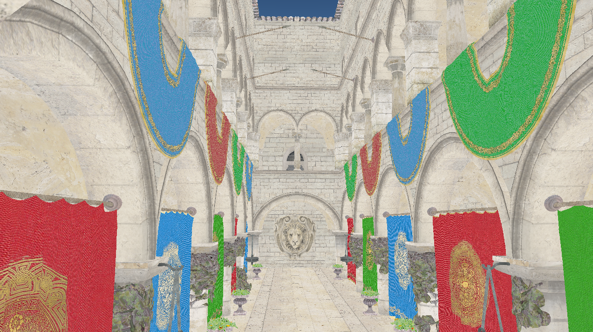

# OpenGL Light Transport

A computer program that I am writing to do ray tracing on the GPU (don't tell me, I already know it needs refactoring)
This was originally a project I had completed throughout April and May 2021, but I am picking it back up in June 2022. My vision for this project is to create a small real-time path tracer entirely on OpenGL with cross-platform and cross-GPU support that can go beyond simple scenes.

## Images

NOTE: I had left this project untouched for about an year, that is why there is a huge difference of time

Acheived sometime May 2021

Acheived sometime May 2021

Acheived June 11, 2022

