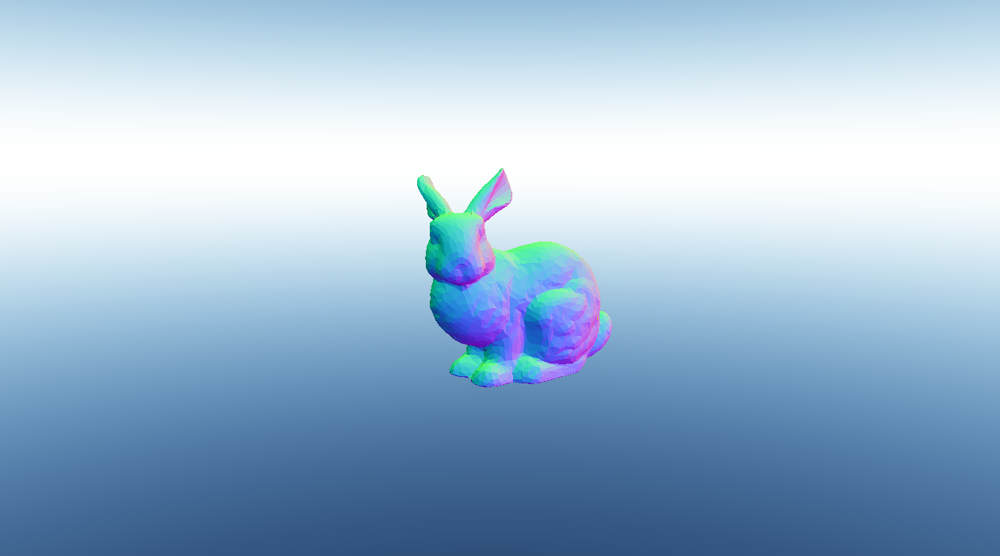
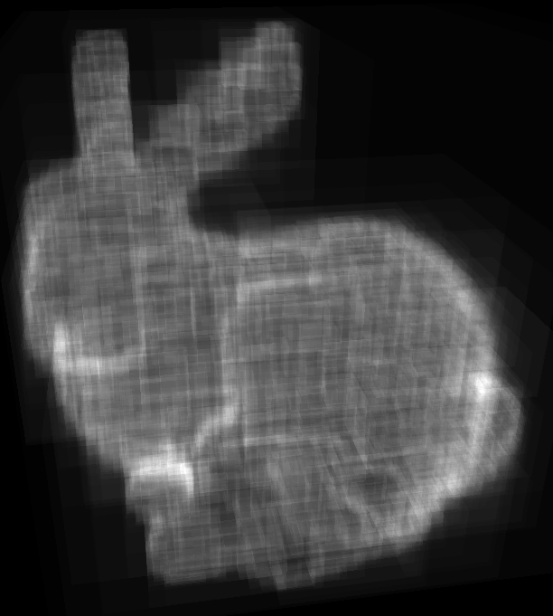
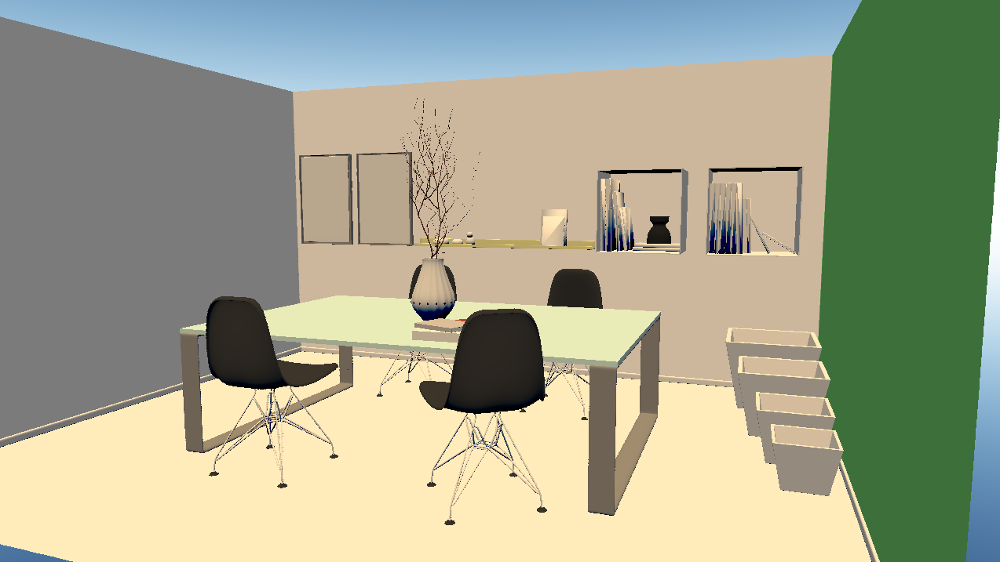
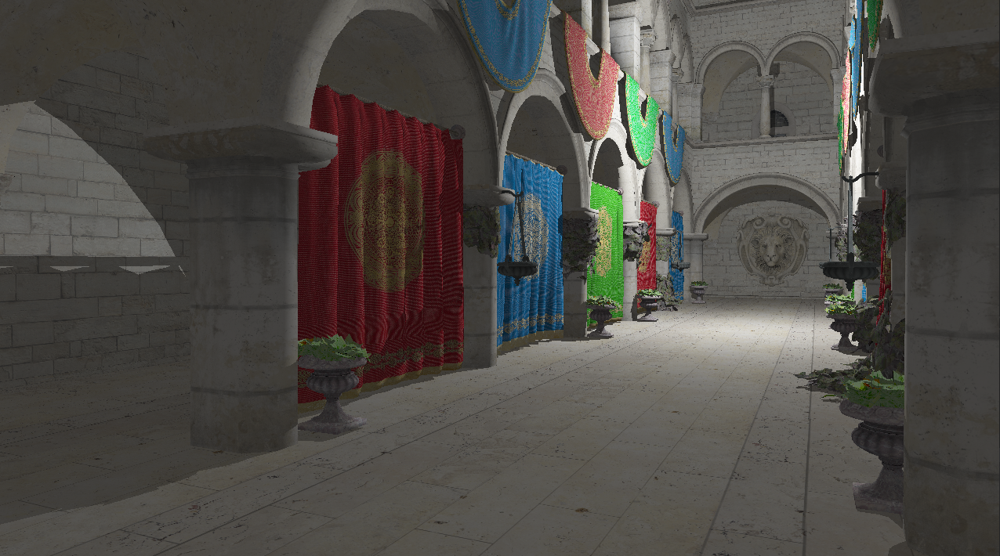
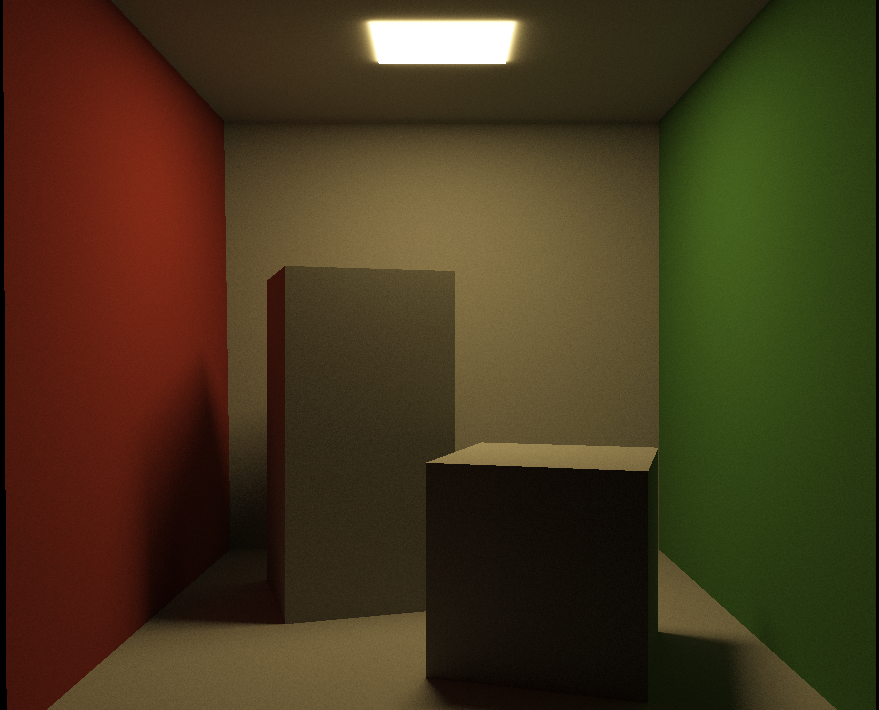

# OpenGL Light Transport

A computer program that I am writing to do ray tracing on the GPU (don't tell me, I already know it needs refactoring)
This was originally a project I had completed throughout April and a bit of May 2021, but I am picking it back up in June 2022. My vision for this project is to create a small real-time path tracer entirely on OpenGL with cross-platform and cross-GPU support that can go beyond simple scenes.

## Images

NOTE: I had left this project untouched for about an year, that is why there is a huge difference of time

Acheived April 7, 2021

Acheived April 8, 2021

Acheived April 21, 2021

Acheived June 11, 2022

Acheived June 13, 2022

Acheived Jun 16, 2022

Acheived Jun 19, 2022
